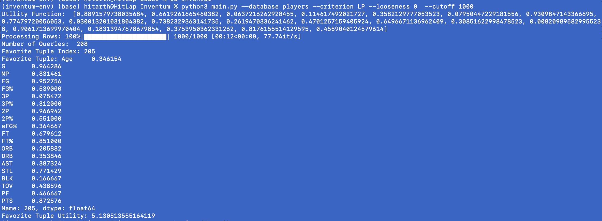
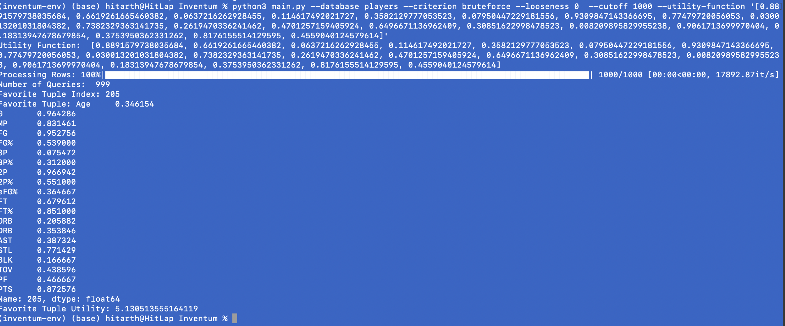

# Inventum
Inventum: Discovering Favorites in Databases via Interactive Regret Minimization

Note that preproc-data used to preprocess the player database is based on code by Zhang et. al. 

Run the command:

1. Setup a Python environment with 
    ```python3 -mvevn inventum-env```
    And activate with 
    ```source inventum-env/bin/activate```
2. Install all the required libraries:
    ```pip install -r requirement.txt```
3. Run the following command to get help running Inventum:

    ```python3 main.py
    usage: main.py [-h] --database DATABASE [--criterion {LP,bruteforce}] [--looseness LOOSENESS] [--negative-attributes NEGATIVE_ATTRIBUTES]
               [--utility-function UTILITY_FUNCTION]
    main.py: error: the following arguments are required: --database
    ```
4. Example command:
    ```Inventum % python3 main.py --database players --criterion LP --looseness 0 --utility-function '[-1]' --negative-attributes '[0]' --cutoff 1000```

5. Example command with random positive utility function:
    ```python3 main.py --database players --criterion LP --looseness 0  --cutoff 1000```

    This command will generate a random utility function which will be printed on the terminal. 
    
6. If you want to compare with Bruteforce (where we just make query for each row), use:
    ```Inventum % python3 main.py --database players --criterion bruteforce --looseness 0 --utility-function '[-1]' --negative-attributes '[0]' --cutoff 1000```

7. To repeat our experiments, run `experiment-script.sh`. The logs will be saved in `experiments` directory.


Demo:

Running our algorithm:


Running bruteforce:


